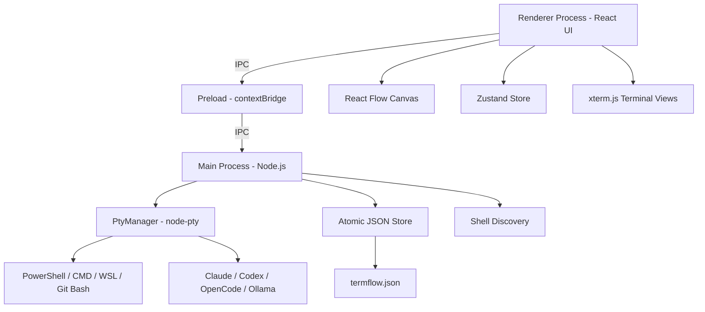

<h1 align="center">TermFlow</h1>
<p align="center">A Windows multi-terminal and multi-agent workspace with adaptive tiled layouts, real PTY sessions, and developer-aware orchestration.</p>

<p align="center">
  <a href="#getting-started">Docs</a> ·
  <a href="#usage">Usage</a> ·
  <a href="https://github.com/palamut62/termflow/releases">Releases</a> ·
  <a href="https://github.com/palamut62/termflow/issues">Issues</a>
</p>

## Badges


## Table of Contents

- [Overview](#overview)
- [Features](#features)
- [Tech Stack](#tech-stack)
- [Architecture](#architecture)
- [Project Structure](#project-structure)
- [Getting Started](#getting-started)
- [Configuration](#configuration)
- [Usage](#usage)
- [Testing](#testing)
- [Packaging](#packaging)
- [Deployment](#deployment)
- [Roadmap](#roadmap)
- [Contributing](#contributing)
- [Security](#security)
- [FAQ](#faq)
- [License](#license)
- [Acknowledgments](#acknowledgments)

## Overview

**TermFlow** is a Windows-native desktop application that combines real terminal emulation with an AI agent orchestration workspace. Think of it as tmux meets n8n: spawn PowerShell, CMD, WSL, or Git Bash terminals, tile them edge to edge inside a fixed workspace, and connect them to AI agents such as Claude Code, Codex, OpenCode, and Ollama.

Every terminal is backed by a real **prebuilt node-pty** process. The canvas is powered by **React Flow** for smooth drag-and-drop, resize, and minimap navigation. Workspaces, terminal sessions, layouts, connections, snippets, SSH profiles, highlights, and workspace environment variables are persisted in an atomic JSON store with rolling backup and corrupt-file recovery.

## Features

### Terminal Engine
- **Real PTY sessions** — every terminal card is a genuine Windows pseudo-terminal via `@lydell/node-pty`
- **5 shell types** — PowerShell, PowerShell Core, CMD, WSL, Git Bash (auto-discovered at startup)
- **Output batching** — 16 ms render batches with 10 000-line ring buffer per terminal
- **Active/passive render modes** — only the focused terminal renders at full rate; unfocused terminals throttle to 250 ms
- **Buffer mode under load** — inactive terminals switch to buffer-only streaming when large workspaces would otherwise stall the UI
- **WebGL acceleration** — optional `xterm-addon-webgl` for smooth high-throughput output
- **Process stats** — CPU and memory usage per terminal via `pidusage`

### AI Agent Orchestration
- **4 agent backends** — Claude Code, Codex, OpenCode, Ollama (launched inside an interactive CMD host)
- **10 predefined agent roles** — Planner, Coder, Reviewer, Tester, Debugger, Git, Documentation, Research, Shell, Ollama Local
- **Typed connections** — control, data, log, error, dependency, parent-child, manual, and trigger edges between nodes
- **Safe agent routing** — marker-based handoff routing plus sanitized, rate-limited one-way continuous routing
- **Agent activity panel** — detects task, tool, handoff, and subagent-like events from agent terminal output
- **Bypass permissions** — optional toggle to launch agents with full auto-approve flags

### Canvas & Layout
- **Adaptive tiled workspace** — terminals fill the available page with no wasted gutter space
- **Focus resizing** — clicking a terminal enlarges it while neighboring terminals share the remaining space
- **Persistent mouse ratios** — drag the active divider to resize every terminal proportionally; custom sizes survive deselection and window resizing
- **Manual graph canvas** — manual and agent-graph modes retain zoom, pan, free positioning, and minimap navigation
- **8 layout modes** — manual, auto-fit, grid, columns, rows, focus, agent-graph, monitoring, split-grid
- **Responsive terminal fitting** — xterm columns and rows are recalculated whenever a panel changes size
- **Viewport persistence** — zoom level and scroll position restored on workspace reload

### Workspace Management
- **Multi-workspace** — create, rename, duplicate, delete entire workspaces
- **Workspace persistence** — terminals, canvas nodes, connections, snippets, profiles, viewport, and settings all survive restart
- **Developer Center** — manifest task runner, Git/runtime/project health checks, and secret-free diagnostics export
- **Developer tools** — workspace environment variables, validated SSH profiles, terminal recording, snippets, project manifests, and import/export
- **Provider profiles** — configure DeepSeek, Ollama, or any CLI/API-compatible provider without storing API keys in profile data
- **System tray lifecycle** — optionally start with Windows, keep PTYs running when the window closes, and quit explicitly from the tray
- **Folder launcher and help** — open any supported shell at a chosen path and learn the main workflows from the in-app help page
- **Detached sessions** — remove a running terminal from the canvas and reattach it later without losing the process
- **Command palette** — Ctrl+K quick-launch for terminals, agents, and workspace commands
- **Settings panel** — active border color, scrollback size, WebGL toggle, snap-to-grid, minimap

## Tech Stack

| Technology | Why it is used |
| --- | --- |
| **Electron 39** | Cross-platform desktop shell; gives us full Node.js access for PTY, filesystem, and process management |
| **React 18 + TypeScript** | Component-based UI with type-safe IPC boundaries between main and renderer |
| **xterm.js 5 + addons** | Industry-standard terminal emulator (fit, search, web-links, WebGL) |
| **@lydell/node-pty** | Prebuilt native Windows pseudo-terminal; one process per terminal card |
| **React Flow (@xyflow/react)** | Canvas-based node graph with built-in drag, resize, edge drawing, and minimap |
| **Zustand** | Lightweight state management; single store for workspace, terminals, canvas, and settings |
| **JSON store** | Atomic local persistence for workspace, terminal, layout, connection, snippet, SSH, env, and highlight data |
| **electron-vite** | Fast Vite-based dev/build toolchain for Electron main/preload/renderer |
| **electron-builder** | NSIS installer and ZIP packaging for Windows distribution |

## Architecture



**Three-process Electron architecture:**

1. **Main process** (`src/main`) — PTY lifecycle management, JSON persistence, shell auto-discovery, IPC handler registration
2. **Preload** (`src/preload`) — contextBridge exposing a typed `window.termflow` API to the renderer
3. **Renderer** (`src/renderer`) — React SPA with React Flow canvas, terminal nodes, sidebar, toolbar, and modals

## Project Structure

```text
.
├── src/
│   ├── main/                  # Electron main process
│   │   ├── index.ts           # App entry, window creation
│   │   ├── pty/
│   │   │   ├── PtyManager.ts  # PTY spawn/kill/resize/write, output batching
│   │   │   └── shells.ts      # Shell discovery + resolution for all kinds
│   │   ├── db/
│   │   │   └── database.ts    # Atomic JSON persistence + CRUD helpers
│   │   └── ipc/
│   │       └── registerIpc.ts # All IPC channel handlers
│   ├── preload/
│   │   ├── index.ts           # contextBridge API exposure
│   │   └── index.d.ts         # Type declarations for window.termflow
│   ├── renderer/
│   │   ├── index.html         # HTML entry point
│   │   └── src/
│   │       ├── App.tsx        # Root component, layout shell
│   │       ├── canvas/
│   │       │   ├── CanvasFlow.tsx   # React Flow wrapper, viewport, minimap
│   │       │   └── TerminalNode.tsx # Terminal card component (xterm + resizer)
│   │       ├── components/
│   │       │   ├── Sidebar.tsx       # Workspace list, terminal palette
│   │       │   ├── Toolbar.tsx       # Layout modes, add terminal, zoom controls
│   │       │   ├── StatusBar.tsx     # Active process stats, connection count
│   │       │   ├── TerminalView.tsx  # xterm.js mount + fit addon
│   │       │   ├── DeveloperCenter.tsx # Tasks, runtime checks, diagnostics
│   │       │   ├── AgentActivityPanel.tsx # Agent task/tool/handoff activity
│   │       │   ├── DetachedSessionsPanel.tsx # Live detached-session recovery
│   │       │   ├── ProjectManifestPanel.tsx # .termflow.json onboarding
│   │       │   ├── CommandPalette.tsx # Ctrl+K quick actions
│   │       │   ├── WorkspaceModal.tsx # Create/edit workspace dialog
│   │       │   ├── SettingsModal.tsx  # App settings panel
│   │       │   ├── ConnectionModal.tsx# Edit connection type/label
│   │       │   ├── CloseModal.tsx     # Unsaved-changes confirm dialog
│   │       │   └── CustomCommandModal.tsx # Custom shell command editor
│   │       ├── store/
│   │       │   └── appStore.ts       # Zustand store (workspace, terminals, canvas, settings, UI)
│   │       ├── autolayout.ts         # Auto-layout algorithms for all 8 modes
│   │       ├── profiles.ts           # Profile definitions, agent roles
│   │       ├── terminalRegistry.ts   # Terminal-to-process lifecycle tracking
│   │       └── styles/
│   │           └── global.css        # Global styles, CSS variables, theme tokens
│   └── shared/
│       └── types.ts            # Shared types, IPC channel names, data models
├── resources/                  # App icons (icon.ico, icon.png)
├── scripts/
│   ├── gen-icons.mjs           # Icon generation script (png → ico)
│   └── verify-artifacts.mjs     # Installer/ZIP release artifact validation
├── electron-builder.yml         # electron-builder packaging config
├── electron.vite.config.ts     # electron-vite build configuration
├── package.json
├── tsconfig.json
├── tsconfig.node.json           # TypeScript config for main + preload
├── tsconfig.web.json            # TypeScript config for renderer
└── README.md
```

## Getting Started

### Prerequisites

- **Windows 10/11** (the app is Windows-only for PTY support)
- **Node.js 20+** (native module rebuild for Electron)
- **Git** (optional, for Git Bash terminal support)
- **WSL** (optional, for WSL terminal support)
- Optionally: Claude Code, Codex, OpenCode, or Ollama CLI tools in PATH for agent nodes

### Installation

```bash
git clone https://github.com/palamut62/termflow.git
cd termflow
npm install
```

`npm install` installs the Electron and native PTY dependencies. Packaging rebuilds `node-pty` against Electron's Node.js headers.

### Run (Development)

```bash
npm run dev
```

This starts the electron-vite dev server with HMR for the renderer and watches the main process for changes.

### Build

```bash
npm run build
```

Produces compiled output in `out/` (main + preload + renderer).

### Verify

```bash
npm run verify
```

Runs unit tests, TypeScript type-checking, and a production Electron build. Use this before packaging or publishing a release.

## Configuration

TermFlow stores settings in the local JSON store and applies them at runtime. No `.env` file is required.

| Setting | Default | Description |
| --- | --- | --- |
| `activeBorderColor` | `#f5e642` | Border color for the currently-focused terminal |
| `scrollback` | `10000` | Terminal scrollback buffer size in lines |
| `passiveThrottleMs` | `250` | Render throttle for unfocused terminals |
| `webgl` | `true` | Use WebGL renderer for terminals (`xterm-addon-webgl`) |
| `snapToGrid` | `false` | Snap terminal cards to a grid when moving |
| `agentAutoApprove` | `false` | Launch AI agents with full bypass permissions |
| `minimap` | `false` | Show React Flow minimap overlay |

All settings are editable via the in-app Settings modal (gear icon in toolbar).

## Usage

1. **Launch the app** — you'll see an empty canvas with a sidebar and toolbar.
2. **Create a workspace** — click "New Workspace" in the sidebar, give it a name and path.
3. **Add terminals** — click the `+` button in the toolbar, pick a shell type (PowerShell, CMD, WSL, Git Bash).
4. **Use the tiled workspace** — terminals automatically divide the fixed workspace and shrink proportionally as more sessions are added.
5. **Resize focus** — click a terminal, then drag its right divider. The active terminal and its neighbors resize together, and the chosen ratio is retained.
6. **Auto-arrange** — select a layout mode from the toolbar dropdown (Grid, Columns, Rows, Focus, Auto-Fit, etc.).
7. **Connect nodes** — right-click a terminal, choose "Start Connection", click the target to draw a typed edge.
8. **Add AI agents** — select "Claude Code", "Codex", "OpenCode", or "Ollama" from the `+` menu. Agents launch in an interactive CMD host.
9. **Broadcast input** — add terminals to the broadcast group from each terminal header, then toggle Broadcast in the toolbar.
10. **Record sessions** — start/stop recording from a terminal header and save recordings as asciinema `.cast` files.
11. **SSH profiles** — Settings > Developer creates SSH profiles, then launch them from the terminal menu or command palette.
12. **Project manifest** — add `.termflow.json` to a repo to suggest tasks, agents, snippets, and env placeholders when the workspace opens.
13. **Command palette** — `Ctrl+K` to search workspaces, terminals, SSH profiles, manifest tasks, snippets, and quick actions.
14. **Minimize/Maximize** — use the card header buttons to collapse or expand terminal panels.
15. **Developer Center** — run project tasks, inspect workspace health, and export sanitized diagnostics.
16. **Detach/Reattach** — detach a live session from its close dialog and restore it from the detached-session panel.
17. **Provider context menu** — right-click empty canvas space to launch a configured provider, open a terminal at a folder, or edit provider profiles.
18. **System tray** — closing the window keeps TermFlow and its PTYs running when tray mode is enabled; use the tray menu to reopen or quit.

### Project Manifest

Create `.termflow.json` in a workspace root:

```json
{
  "name": "My App",
  "tasks": [
    { "name": "Dev Server", "command": "npm run dev", "shell": "cmd" },
    { "name": "Tests", "command": "npm test", "shell": "cmd" }
  ],
  "agents": [
    { "name": "Reviewer", "role": "Reviewer", "kind": "codex" }
  ],
  "snippets": [
    { "name": "Git Status", "command": "git status" }
  ],
  "env": [
    { "key": "OPENAI_API_KEY", "masked": true }
  ]
}
```

When the workspace opens, TermFlow shows a manifest panel. Applying it imports snippets/env placeholders and starts declared agents. Tasks can be launched one by one without applying the full manifest.

## Testing

```bash
npm run test
npm run typecheck
npm run verify
```

- `npm run test` runs the Vitest unit suite.
- `npm run typecheck` validates the Electron main, preload, shared, and renderer TypeScript projects.
- `npm run verify` runs tests, type-checking, and a production Electron build in sequence.

## Packaging

```bash
npm run package
```

This runs `electron-vite build` followed by `electron-builder --win`, producing:

- **NSIS installer** — `dist/TermFlow-0.1.0-x64.exe`
- **Portable ZIP** — `dist/TermFlow-0.1.0-x64.zip`

The installer supports custom install directory and generates Start Menu shortcuts.

Use `npm run package:verify` for release work. It also rejects missing, truncated, or invalid installer/ZIP artifacts.

### Icons

```bash
npm run icons
```

Generates `icon.ico` and `icon.png` from `resources/` source images using `sharp` + `png-to-ico`.

## Deployment

TermFlow is distributed as a Windows desktop application rather than a hosted web service. Run:

```bash
npm run package:verify
```

Publish the verified NSIS installer and ZIP from `dist/` to a GitHub Release. Do not publish `win-unpacked/` as the primary download; it is intended for local smoke testing.

## Roadmap

- [ ] Multi-monitor detached terminal windows
- [x] SSH session profiles with key and jump-host launch
- [x] Agent-to-agent message routing via edges
- [x] Workspace export/import (JSON)
- [x] Project manifest onboarding
- [x] Agent activity detection panel
- [ ] Terminal recording replay
- [ ] Plugin system for custom shell integrations
- [ ] Linux/macOS PTY support
- [ ] Team workspace sharing via WebSocket

## Contributing

1. Fork the repository.
2. Create a feature branch: `git checkout -b feat/my-feature`.
3. Commit changes with clear messages following [Conventional Commits](https://www.conventionalcommits.org/).
4. Open a pull request with context, screenshots for UI changes, and test steps.

For larger changes, please open an issue first to discuss the approach.

## Security

TermFlow spawns real OS-level processes with the user's full permissions. AI agents (Claude Code, Codex, etc.) are launched with `--dangerously-skip-permissions` / `--dangerously-bypass-approvals-and-sandbox` when the "auto-approve" setting is enabled — **use this with caution in production directories**.

Report vulnerabilities privately via GitHub Security Advisories or email to the maintainer. Do not open public issues for sensitive vulnerabilities.

## FAQ

### Who should use TermFlow?

Developers and power users on Windows who juggle multiple terminals and AI coding agents simultaneously. If you find yourself alt-tabbing between terminal windows and AI tools, TermFlow puts them all on one canvas.

### Is this production-ready?

TermFlow is in active early development (v0.1.0). The core terminal engine, workspace persistence, and canvas interactions are stable, but expect rough edges and breaking changes.

### Does it work on Linux or macOS?

Not yet. The PTY layer uses `node-pty` with Windows-specific ConPTY integration. Linux/macOS support is on the roadmap.

### How is this different from Windows Terminal or tmux?

TermFlow combines terminals AND AI agents on a 2D canvas with typed connections between them. It's a spatial thinking tool — not just a tabbed terminal multiplexer.

## License

Distributed under the MIT License. See `LICENSE` for details.

## Acknowledgments

- [xterm.js](https://xtermjs.org/) — the gold-standard terminal emulator for the web
- [React Flow](https://reactflow.dev/) — infinitely customizable node graph library
- [Electron](https://www.electronjs.org/) — the desktop app framework
- [@lydell/node-pty](https://github.com/lydell/node-pty) — prebuilt native pseudo-terminal bindings
- [Zustand](https://zustand-demo.pmnd.rs/) — minimal yet powerful state management
