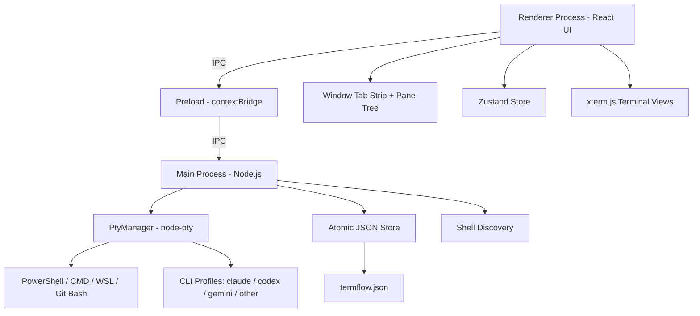

<h1 align="center">TermFlow</h1>
<p align="center">A Windows terminal multiplexer inspired by tmux: sessions, windows, and split panes over real PTY sessions, with developer-aware tooling built in.</p>

<p align="center">
  <a href="#getting-started">Docs</a> ·
  <a href="#usage">Usage</a> ·
  <a href="https://github.com/palamut62/termflow/releases">Releases</a> ·
  <a href="https://github.com/palamut62/termflow/issues">Issues</a>
</p>

## Badges


## Table of Contents

- [Overview](#overview)
- [Features](#features)
- [Tech Stack](#tech-stack)
- [Architecture](#architecture)
- [Project Structure](#project-structure)
- [Getting Started](#getting-started)
- [Configuration](#configuration)
- [Usage](#usage)
- [Testing](#testing)
- [Packaging](#packaging)
- [Deployment](#deployment)
- [Roadmap](#roadmap)
- [Contributing](#contributing)
- [Security](#security)
- [FAQ](#faq)
- [License](#license)
- [Acknowledgments](#acknowledgments)

## Overview

**TermFlow** is a Windows-native desktop application that brings a tmux-style terminal multiplexer to Windows. A workspace is a session, each session holds one or more windows (tabs), and each window holds a binary tree of split panes. Spawn PowerShell, PowerShell Core, CMD, WSL, or Git Bash terminals — or start any configured CLI, including tools like `claude`, `codex`, and `gemini`, which are just ordinary launch profiles alongside the shells.

Every terminal is backed by a real **prebuilt node-pty** process running behind Windows ConPTY. Navigation follows familiar tmux conventions: a configurable prefix key (Ctrl+A by default, or Ctrl+B), a window tab strip, and vi-style copy mode. Workspaces, terminal sessions, window/pane layouts, snippets, SSH profiles, highlights, and workspace environment variables are persisted in an atomic JSON store with rolling backup and corrupt-file recovery.

## Features

### Terminal Engine
- **Real PTY sessions** — every terminal card is a genuine Windows pseudo-terminal via `@lydell/node-pty`
- **5 shell types** — PowerShell, PowerShell Core, CMD, WSL, Git Bash (auto-discovered at startup)
- **Output batching** — 16 ms render batches with 10 000-line ring buffer per terminal
- **Active/passive render modes** — only the focused terminal renders at full rate; unfocused terminals throttle to 250 ms
- **Buffer mode under load** — inactive terminals switch to buffer-only streaming when large workspaces would otherwise stall the UI
- **WebGL acceleration** — optional `xterm-addon-webgl` for smooth high-throughput output
- **Process stats** — CPU and memory usage per terminal via `pidusage`

### Launch Profiles
- **Shells and CLI tools as equal profiles** — PowerShell, PowerShell Core, CMD, WSL, Git Bash, and any configured CLI (including `claude`, `codex`, `gemini`) are all plain launch profiles with no special orchestration status
- **Provider profiles** — configure additional CLI/API-compatible tools without storing API keys in profile data
- **Bypass permissions** — optional toggle to launch AI CLI profiles with full auto-approve flags

### tmux-Style Sessions, Windows, and Panes
- **Sessions** — a workspace is a session; create, rename, duplicate, and delete sessions
- **Windows (tabs)** — a window tab strip supports click-to-switch, double-click rename, drag-to-reorder, middle-click/× close, and `+` for a new window
- **Prefix-key model** — Ctrl+A (default) or Ctrl+B, configurable in Settings → Terminal → "tmux prefix key"; pressing the prefix twice sends the raw control byte to the terminal (tmux `send-prefix` behavior)
- **Prefix commands** — `c` new window, `n`/`p` next/previous window, `0`-`9` jump to window, `,` rename, `d` detach, `x` close, `%` vertical split, `"` horizontal split, `h`/`j`/`k`/`l` or arrow keys to move between panes, `o` cycle to the next pane, `z` zoom the current pane, `[` enter copy mode, `?` show help
- **Split panes** — `Ctrl+Shift+D` splits vertically, `Ctrl+Shift+E` splits horizontally; drag the divider between panes to change the ratio; pane ratios are saved with the workspace, pane zoom is not
- **Copy mode (prefix + `[`)** — vi-style navigation with `h`/`j`/`k`/`l` and arrow keys, `w`/`b` word movement, `0`/`$` line start/end, `g`/`G` buffer start/end, `Ctrl+U`/`Ctrl+D` half-page, `Ctrl+B`/`Ctrl+F` and Page Up/Down full-page, `Space` or `v` to start selection, `Enter` or `y` to copy and exit, `Escape` to cancel selection or exit, `q` to exit, `/` and `?` to search, `n`/`N` for next/previous match; a COPY badge appears in the status bar while active. Known limitation: multi-line selection is line-based due to the xterm API
- **Legacy workspace migration** — old workspace files open without issue; the migration path converts former canvas cards into windows and preserves terminals and pane trees, dropping dead fields

### Workspace Management
- **Multi-workspace** — create, rename, duplicate, delete entire workspaces
- **Workspace persistence** — sessions, windows, pane trees, terminals, snippets, profiles, and settings all survive restart
- **Developer Center** — manifest task runner, Git/runtime/project health checks, and secret-free diagnostics export
- **Developer tools** — workspace environment variables, validated SSH profiles, terminal recording, snippets, project manifests, and import/export
- **Provider profiles** — configure DeepSeek, Ollama, or any CLI/API-compatible provider without storing API keys in profile data
- **System tray lifecycle** — optionally start with Windows, keep PTYs running when the window closes, and quit explicitly from the tray
- **Folder launcher and help** — open any supported shell at a chosen path and learn the main workflows from the in-app help page
- **Unified themes and transparency** — MarkNote-compatible Latte, Frappé, Macchiato, Mocha, Matcha, Kanagawa, Ayu, and Rosé Pine palettes affect terminals, chrome, menus, and dialogs
- **Full-permission path launch** — start a profile (shell or CLI tool) in a selected trusted directory
- **Close All** — terminate every terminal process in the active workspace after an in-app confirmation
- **Detached sessions** — remove a running terminal from its window and reattach it later without losing the process, within the same app run
- **Command palette** — Ctrl+K quick-launch for terminals, profiles, and workspace commands
- **Settings panel** — active border color, scrollback size, WebGL toggle, tmux prefix key

### Developer Productivity
- **Developer Workbench** — browse workspace files, preview safe text files, inspect command history, and perform Git diff/stage/unstage/commit operations
- **Global terminal search** — search across all live terminal buffers from one modal
- **Package task runner** — detect npm, pnpm, yarn, or bun scripts and launch them with one click
- **Workspace templates** — clone a reusable workspace definition or save the current workspace as a template
- **Task triggers** — run follow-up tasks on process exit or a timer schedule
- **AI log summary** — send terminal output to a selected AI CLI profile for analysis
- **Deep Git integration** — follow OSC 7 working-directory changes and expose repository actions per terminal
- **Desktop notifications** — notify on long command completion or error output
- **Duplicate** — duplicate a terminal's launch configuration into a new pane or window
- **Credential vault** — Windows `safeStorage` encryption with global or workspace scope; secret values never return to the renderer
- **Plugin SDK** — install validated manifest-only plugins that expose explicit terminal commands without injecting renderer code
- **Crash recovery** — detect unclean shutdowns, recreate persisted terminal sessions, and choose restore or clean start
- **Stable/beta updates** — GitHub Releases updater with channel selection, download progress, and restart-to-install flow

### Known Limitations / Roadmap
- No persistent PTY daemon yet — closing the app ends all sessions; there is no true tmux-style `detach`/`attach` across app restarts. Reattaching a detached session only works while TermFlow keeps running.

## Tech Stack

| Technology | Why it is used |
| --- | --- |
| **Electron 39** | Cross-platform desktop shell; gives us full Node.js access for PTY, filesystem, and process management |
| **React 18 + TypeScript** | Component-based UI with type-safe IPC boundaries between main and renderer |
| **xterm.js 5 + addons** | Industry-standard terminal emulator (fit, search, web-links, WebGL) |
| **@lydell/node-pty** | Prebuilt native Windows pseudo-terminal; one process per terminal pane |
| **Zustand** | Lightweight state management; single store for workspace, sessions/windows/panes, terminals, and settings |
| **JSON store** | Atomic local persistence for workspace, terminal, window/pane layout, snippet, SSH, env, and highlight data |
| **electron-vite** | Fast Vite-based dev/build toolchain for Electron main/preload/renderer |
| **electron-builder** | NSIS installer and ZIP packaging for Windows distribution |

## Architecture


```mermaid
graph TD
    A[Renderer Process - React UI] -->|IPC| B[Preload - contextBridge]
    B -->|IPC| C[Main Process - Node.js]
    C --> D[PtyManager - node-pty]
    C --> E[Atomic JSON Store]
    C --> F[Shell Discovery]
    D --> G[PowerShell / CMD / WSL / Git Bash]
    D --> H[CLI Profiles: claude / codex / gemini / other]
    E --> I[termflow.json]
    A --> J[Window Tab Strip + Pane Tree]
    A --> K[Zustand Store]
    A --> L[xterm.js Terminal Views]
```

**Three-process Electron architecture:**

1. **Main process** (`src/main`) — PTY lifecycle management, JSON persistence, shell auto-discovery, IPC handler registration
2. **Preload** (`src/preload`) — contextBridge exposing a typed `window.termflow` API to the renderer
3. **Renderer** (`src/renderer`) — React SPA with a window tab strip, a split-pane tree per window, sidebar, toolbar, and modals

## Project Structure

```text
.
├── src/
│   ├── main/                  # Electron main process
│   │   ├── index.ts           # App entry, window creation
│   │   ├── pty/
│   │   │   ├── PtyManager.ts  # PTY spawn/kill/resize/write, output batching
│   │   │   └── shells.ts      # Shell discovery + resolution for all kinds
│   │   ├── db/
│   │   │   └── database.ts    # Atomic JSON persistence + CRUD helpers
│   │   └── ipc/
│   │       └── registerIpc.ts # All IPC channel handlers
│   ├── preload/
│   │   ├── index.ts           # contextBridge API exposure
│   │   └── index.d.ts         # Type declarations for window.termflow
│   ├── renderer/
│   │   ├── index.html         # HTML entry point
│   │   └── src/
│   │       ├── App.tsx        # Root component, layout shell
│   │       ├── canvas/
│   │       │   ├── WindowTabs.tsx    # Window (tab) strip: switch, rename, reorder, close
│   │       │   └── WindowView.tsx    # Split-pane tree renderer for the active window
│   │       ├── components/
│   │       │   ├── Sidebar.tsx       # Workspace list, terminal palette
│   │       │   ├── Toolbar.tsx       # Add terminal, broadcast, zoom controls
│   │       │   ├── StatusBar.tsx     # Active process stats, copy-mode badge
│   │       │   ├── TerminalView.tsx  # xterm.js mount + fit addon
│   │       │   ├── DeveloperCenter.tsx # Tasks, runtime checks, diagnostics
│   │       │   ├── DeveloperWorkbench.tsx # Files, command history, Git actions
│   │       │   ├── DetachedSessionsPanel.tsx # Live detached-session recovery
│   │       │   ├── ProjectManifestPanel.tsx # .termflow.json onboarding
│   │       │   ├── CommandPalette.tsx # Ctrl+K quick actions
│   │       │   ├── WorkspaceModal.tsx # Create/edit workspace dialog
│   │       │   ├── SettingsModal.tsx  # App settings panel (incl. tmux prefix key)
│   │       │   ├── ProfileModal.tsx   # Edit a launch profile (shell or CLI tool)
│   │       │   ├── CloseModal.tsx     # Unsaved-changes confirm dialog
│   │       │   └── CustomCommandModal.tsx # Custom shell command editor
│   │       ├── store/
│   │       │   ├── appStore.ts       # Zustand store (workspace, terminals, windows/panes, settings, UI)
│   │       │   └── slices/            # layoutSlice, terminalSlice, devResourcesSlice
│   │       ├── copyMode.ts           # vi-style copy mode navigation/search logic
│   │       ├── paneUtils.ts          # Pane-tree split/close/resize helpers
│   │       ├── prefixKeys.ts         # tmux prefix-key command dispatch
│   │       ├── profiles.ts           # Launch profile definitions (shells + CLI tools)
│   │       ├── terminalRegistry.ts   # Terminal-to-process lifecycle tracking
│   │       └── styles/
│   │           └── global.css        # Global styles, CSS variables, theme tokens
│   └── shared/
│       └── types.ts            # Shared types, IPC channel names, data models
├── resources/                  # App icons (icon.ico, icon.png)
├── scripts/
│   ├── gen-icons.mjs           # Icon generation script (png → ico)
│   └── verify-artifacts.mjs     # Installer/ZIP release artifact validation
├── electron-builder.yml         # electron-builder packaging config
├── electron.vite.config.ts     # electron-vite build configuration
├── package.json
├── tsconfig.json
├── tsconfig.node.json           # TypeScript config for main + preload
├── tsconfig.web.json            # TypeScript config for renderer
└── README.md
```

## Getting Started

### Prerequisites

- **Windows 10/11** (the app is Windows-only for PTY support)
- **Node.js 20+** (native module rebuild for Electron)
- **Git** (optional, for Git Bash terminal support)
- **WSL** (optional, for WSL terminal support)
- Optionally: Claude Code, Codex, OpenCode, or Ollama CLI tools in PATH for agent nodes

### Installation

```bash
git clone https://github.com/palamut62/termflow.git
cd termflow
npm install
```

`npm install` installs the Electron and native PTY dependencies. Packaging rebuilds `node-pty` against Electron's Node.js headers.

### Run (Development)

```bash
npm run dev
```

This starts the electron-vite dev server with HMR for the renderer and watches the main process for changes.

### Build

```bash
npm run build
```

Produces compiled output in `out/` (main + preload + renderer).

### Verify

```bash
npm run verify
```

Runs unit tests, TypeScript type-checking, and a production Electron build. Use this before packaging or publishing a release.

## Configuration

TermFlow stores settings in the local JSON store and applies them at runtime. No `.env` file is required.

| Setting | Default | Description |
| --- | --- | --- |
| `activeBorderColor` | `#f5e642` | Border color for the currently-focused terminal |
| `scrollback` | `10000` | Terminal scrollback buffer size in lines |
| `passiveThrottleMs` | `250` | Render throttle for unfocused terminals |
| `webgl` | `true` | Use WebGL renderer for terminals (`xterm-addon-webgl`) |
| `tmuxPrefixKey` | `Ctrl+A` | Prefix key used for tmux-style window/pane commands (`Ctrl+A` or `Ctrl+B`) |
| `agentAutoApprove` | `false` | Launch AI CLI profiles with full bypass permissions |
| `transparency` | `100` | Unified window, terminal, menu, and dialog opacity (`100` disables transparency) |
| `startAtLogin` | `true` | Start the packaged TermFlow application with Windows |
| `minimizeToTray` | `true` | Keep PTYs running when the main window is closed |

All settings are editable via the in-app Settings modal (gear icon in toolbar).

## Usage

1. **Launch the app** — you'll see an empty workspace with a sidebar and toolbar.
2. **Create a workspace (session)** — click "New Workspace" in the sidebar, give it a name and path.
3. **Add a window** — click `+` in the window tab strip, or press prefix then `c`, to open a new window (tab).
4. **Add terminals** — pick a profile (PowerShell, CMD, WSL, Git Bash, or a configured CLI tool like `claude`/`codex`/`gemini`) from the `+` menu.
5. **Split panes** — `Ctrl+Shift+D` splits the focused pane vertically, `Ctrl+Shift+E` splits it horizontally; drag the divider to resize.
6. **Navigate with the prefix key** — press the prefix (Ctrl+A by default), then a command key: `n`/`p` next/previous window, `0`-`9` jump to a window, `,` rename, `x` close, `%`/`"` split, `h`/`j`/`k`/`l` move between panes, `o` cycle panes, `z` zoom the pane, `[` copy mode, `?` help.
7. **Copy mode** — prefix then `[`, navigate with vi keys, `Space`/`v` to start a selection, `Enter`/`y` to copy and exit, `q`/`Escape` to exit.
8. **Broadcast input** — add terminals to the broadcast group from each terminal header, then toggle Broadcast in the toolbar.
9. **Record sessions** — start/stop recording from a terminal header and save recordings as asciinema `.cast` files.
10. **SSH profiles** — Settings > Developer creates SSH profiles, then launch them from the terminal menu or command palette.
11. **Project manifest** — add `.termflow.json` to a repo to suggest tasks, profiles, snippets, and env placeholders when the workspace opens.
12. **Command palette** — `Ctrl+K` to search workspaces, terminals, SSH profiles, manifest tasks, snippets, and quick actions.
13. **Developer Center** — run project tasks, inspect workspace health, and export sanitized diagnostics.
14. **Detach/Reattach** — detach a live session from its close dialog and restore it from the detached-session panel (only while TermFlow keeps running; there is no cross-restart daemon yet).
15. **Provider context menu** — right-click empty workspace space to launch a configured profile, open a terminal at a folder, or edit profiles.
16. **System tray** — closing the window keeps TermFlow and its PTYs running when tray mode is enabled; use the tray menu to reopen or quit.

### Project Manifest

Create `.termflow.json` in a workspace root:

```json
{
  "name": "My App",
  "tasks": [
    { "name": "Dev Server", "command": "npm run dev", "shell": "cmd" },
    { "name": "Tests", "command": "npm test", "shell": "cmd" }
  ],
  "agents": [
    { "name": "Reviewer", "role": "Reviewer", "kind": "codex" }
  ],
  "snippets": [
    { "name": "Git Status", "command": "git status" }
  ],
  "env": [
    { "key": "OPENAI_API_KEY", "masked": true }
  ]
}
```

The `agents` entries just declare which CLI-tool profile (e.g. `codex`, `claude`) to start as a terminal — there is no orchestration, routing, or role logic behind them. When the workspace opens, TermFlow shows a manifest panel. Applying it imports snippets/env placeholders and starts the declared profiles. Tasks can be launched one by one without applying the full manifest.

## Testing

```bash
npm run test
npm run typecheck
npm run verify
```

- `npm run test` runs the Vitest unit suite.
- `npm run typecheck` validates the Electron main, preload, shared, and renderer TypeScript projects.
- `npm run verify` runs tests, type-checking, and a production Electron build in sequence.
- `npm run test:e2e` builds the app and launches a real Electron window with Playwright to verify Help and Developer Workbench surfaces.

The current suite covers pane operations, validation, PTY routing/recording limits, and the refactored terminal/layout/developer-resource store slices.

## Packaging

```bash
npm run package
```

This runs `electron-vite build` followed by `electron-builder --win`, producing:

- **NSIS installer** — `dist/TermFlow-0.1.0-x64.exe`
- **Portable ZIP** — `dist/TermFlow-0.1.0-x64.zip`

The installer supports custom install directory and generates Start Menu shortcuts.

Use `npm run package:verify` for release work. It also rejects missing, truncated, or invalid installer/ZIP artifacts.

### Icons

```bash
npm run icons
```

Generates `icon.ico` and `icon.png` from `resources/` source images using `sharp` + `png-to-ico`.

## Deployment

TermFlow is distributed as a Windows desktop application rather than a hosted web service. Run:

```bash
npm run package:verify
```

Publish the verified NSIS installer and ZIP from `dist/` to a GitHub Release. Do not publish `win-unpacked/` as the primary download; it is intended for local smoke testing.

For automatic updates, stable releases use normal semantic versions and the `latest` channel. Beta releases use prerelease versions such as `0.2.0-beta.1` and are offered only to users on the beta channel. Upload the generated installer, blockmap, and channel metadata (`latest.yml` or beta metadata) together.

### Plugin SDK

TermFlow supports declarative workflow plugins and optional runtime plugins. Runtime code never loads into the renderer or main process: it runs in a dedicated utility process inside a restricted VM and receives only the declared capability API.

```json
{
  "schemaVersion": 2,
  "id": "acme.dev-tools",
  "name": "ACME Dev Tools",
  "version": "1.0.0",
  "publisher": "ACME",
  "entry": "entry.js",
  "activationEvents": ["workspaceContains:package.json"],
  "permissions": ["terminal:execute"],
  "commands": [
    { "id": "test", "title": "Run tests", "command": "npm test", "shell": "cmd" }
  ]
}
```

Create and package a plugin with the bundled SDK CLI:

```bash
npm run plugin -- init ./my-plugin
npm run plugin -- validate ./my-plugin
npm run plugin -- test ./my-plugin
npm run plugin -- pack ./my-plugin
```

The resulting `.tfplugin` bundle contains its manifest and runtime files plus a SHA-256 integrity value. Install bundles from Extensions, or use `npm run plugin -- install ./my-plugin` during local development. Set `TERMFLOW_PLUGIN_DIR` to override the development install directory.

Supported activation events are `onStartupFinished`, `workspaceContains:<file>`, `platform:win32`, `platform:linux`, `platform:darwin`, and `*`. Runtime permissions are explicit and shown in the manager. Plugins can be disabled per installation, reloaded during development, and inspected through Plugin diagnostics. A registry catalog can be supplied at `%APPDATA%/termflow/plugin-registry.json`; registry packages must use HTTPS and may pin the bundle SHA-256.

## Roadmap

- [ ] Persistent PTY daemon with true tmux-style `detach`/`attach` across app restarts
- [ ] Multi-monitor detached terminal windows
- [x] SSH session profiles with key and jump-host launch
- [x] Workspace export/import (JSON)
- [x] Project manifest onboarding
- [ ] Terminal recording replay
- [x] Plugin SDK, isolated runtime, diagnostics, signed-integrity packages, and registry catalog
- [ ] Linux/macOS PTY support
- [ ] Team workspace sharing via WebSocket

## Contributing

1. Fork the repository.
2. Create a feature branch: `git checkout -b feat/my-feature`.
3. Commit changes with clear messages following [Conventional Commits](https://www.conventionalcommits.org/).
4. Open a pull request with context, screenshots for UI changes, and test steps.

For larger changes, please open an issue first to discuss the approach.

## Security

TermFlow spawns real OS-level processes with the user's full permissions. AI CLI profiles (Claude Code, Codex, etc.) are launched with `--dangerously-skip-permissions` / `--dangerously-bypass-approvals-and-sandbox` when the "auto-approve" setting is enabled — **use this with caution in production directories**.

Report vulnerabilities privately via GitHub Security Advisories or email to the maintainer. Do not open public issues for sensitive vulnerabilities.

## FAQ

### Who should use TermFlow?

Developers and power users on Windows who want tmux-style sessions, windows, and split panes, plus terminal-native AI CLI tools (Claude Code, Codex, Gemini, etc.), without leaving native Windows PTYs behind.

### Is this production-ready?

TermFlow is in active early development (v0.1.0). The core terminal engine and workspace persistence are stable, but expect rough edges and breaking changes.

### Does it work on Linux or macOS?

Not yet. The PTY layer uses `node-pty` with Windows-specific ConPTY integration. Linux/macOS support is on the roadmap.

### How is this different from tmux itself?

TermFlow brings the tmux session/window/pane model and prefix-key workflow to native Windows PTYs with a graphical UI, plus developer tooling (Workbench, snippets, global search, plugin SDK) built in. It does not yet have a persistent daemon, so there is no real cross-restart `detach`/`attach` — see the Roadmap.

## License

Distributed under the MIT License. See `LICENSE` for details.

## Acknowledgments

- [xterm.js](https://xtermjs.org/) — the gold-standard terminal emulator for the web
- [tmux](https://github.com/tmux/tmux) — inspiration for the session/window/pane and prefix-key model
- [Electron](https://www.electronjs.org/) — the desktop app framework
- [@lydell/node-pty](https://github.com/lydell/node-pty) — prebuilt native pseudo-terminal bindings
- [Zustand](https://zustand-demo.pmnd.rs/) — minimal yet powerful state management
